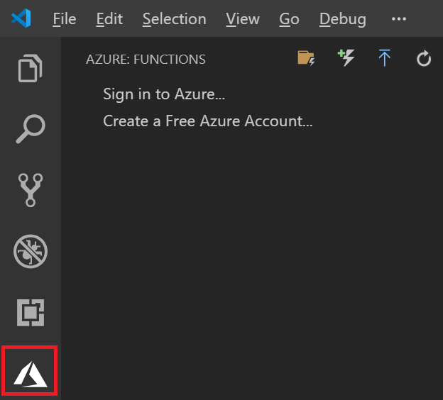

# Hello, World! with Azure Functions - Visual Studio Experiences

You can experiment with Azure Functions Visual Studio experiences in this lab, including Visual Studio Code and Visual Studio 2019. This lab is based on official Azure documentations:
-   [Create your first function using Visual Studio Code](https://docs.microsoft.com/en-us/azure/azure-functions/functions-create-first-function-vs-code)
-   [Create your first function using Visual Studio](https://docs.microsoft.com/en-us/azure/azure-functions/functions-create-your-first-function-visual-studio)

## Visual Studio Code

### Creating the function

1. In **Visual Studio Code**, install [Azure Functions for Visual Studio Code (Preview)](https://marketplace.visualstudio.com/items?itemName=ms-azuretools.vscode-azurefunctions). This adds a new Azure icon to your left side bar:
   
2. Press **F1** to bring the command palette. Type in *Functions* in the palette and select **Azure Functions: Create New Project...**
3. Choose a target folder. Then, choose **C#** as the project language, **Azure Functions v2** as the target runtime, and **HttpTrigger** as the template.
4. Enter *HelloWorld* as the **Function nam**. And then, provide a namespace (or simply press **Enter** to accept the default).
5. Select *Function* as the **AccessRights**. This requires the caller providing an access key when invoking the function.
6. Finally, select **Add to workspace**.
7. If prompted, install all available extensions. This is optional but highly recommended.

The wizard creates several files:

* **host.json** affects global configuration options that affect all functions in an function app.
* **local.settings.json** contains local development settings.  
* **HelloWorld.cs** is the C# function implementation.

### Testing the function

>NOTE: Optionally, set a break point in your **Run** method.

1. Press **F5** to launch the function.
2. In your Visual Studio Code **Terminal** window, you'll see the local function endpoint:
```
Now listening on: http://0.0.0.0:7071
Application started. Press Ctrl+C to shut down.

Http Functions:

        HelloWorld: [GET,POST] http://localhost:7071/api/HelloWorld
```
3. Copy and paste the Url to your browser (or Ctrl+Click on the link). You'll see the following message:
```
Please pass a name on the query string or in the request body
```
4. Add a *name* parameter to your query string, for example:

```
http://localhost:7071/api/HelloWorld?name=Haishi
```

5. This time, you'll see a "Hello, *\<your name\>*" message displayed.

### Publishing the function

1. Click on the *Azure icon* in your side bar.
2. If you haven't logged in to Azure, click on the **Sign in to Azure...** link, which opens a browser for you to log in to your Azure subscription. Once you are logged in, the panel displays a list of all your Azure subscriptions.
3. Right-click on the Azure subscription you want to use, and select **Create Functions App in Azure...**. 
4. Enter a globally unique Function App name and pressy **[Enter]** to continue.
5. Once the Functions app is created, expaned your Azure subscription node, right-click on the Function app, and select **Deploy to Function App...**.

6. Once the deployment finishes, expaned the Function App to reveal the newly deployed Function. Right-click the function and select **Copy Function Url**.


> NOTE: This URL contains the authentication key required to invoke the function.

7. Append a *name* parameter to the Url, for example:

```
https://helloworld35.azurewebsites.net/api/HelloWorld?code=<key>&name=Haishi
```
8. Open the url in browser and you should see the "Hello, *\<your name\>*" message.

## Visual Studio 2019

### Creating the function

> NOTE: You need **Azure development workload** installed.

1. In **Visual Studio 2019**, create a new **Azure Function** project.

2. Enter a project name, choose a project location, and click on the **Create** button.

3. Choose the **Http trigger** template, leavel **Authorization level** at the default *Anoymous* level, and click on the **Create** button.


>NOTE: Make sure **Anoymous** authentication level is selected in this case.

### Testing the function

>NOTE: Optionally, set a break point in your **Run** method.

1. Press **F5** to launch the function.
2. Copy the Function Url from the newly launched terminal window.
3. Copy and paste the Url to your browser. You'll see the following message:
```
Please pass a name on the query string or in the request body
```
4. Add a *name* parameter to your query string, for example:

```
http://localhost:7071/api/HelloWorld?name=Haishi
```

5. This time, you'll see a "Hello, *\<your name\>*" message displayed.

### Publishing the function

1. In **Solution Explorer**, right-click on the project and select **Publish...**

>NOTE: If the publish wizard doesn't pop up, click on the **Start** button.

2. In publish wizard, select a hosting plan, and click on the **Publish** button.


3. Select name, subscription, resource group (existing or new) and storage account (existing or new) for your Function app, and then click on the **Create** button.


4. Once the publish finishes, click on the **Site URL** to open it in browser. You'll see a "your function app is running" message.
   
5. Append "api/Function1?name=Haishi" to the Url and you should see the  "Hello, *\<your name\>*" message displayed.