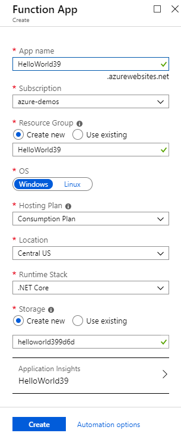
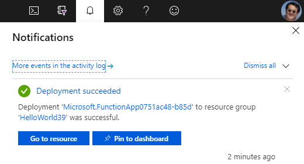
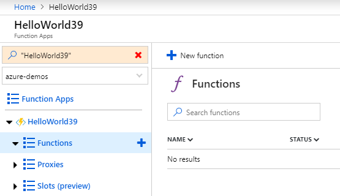

# Hello, World! with Azure Functions - Azure Portal Experience

1. Log in to [Azure Portal](https://portal.azure.com).
2. Click on the **Create a resource** link at the upper-left corner.
3. Click on the **Serverless Function App** link. If the link is invisible on the page, search for "Function App" in the search box and click on the found entry.
4. Enter an **App name** and click on the **Create** button, accepting all default settings.

5. Once the Function app is created, go to the deployed resource. You can get the link by clicking on the notification icon (a bell) to the upper-right corner, and click on the  **Go to resource** button.

6. Click on the **plus icon** besides **Function**, and then, click on the **New function** link.

7. Click on the **HTTP Trigger** tile. Then, enter a new Function name, and click on the **Create** button.

8. On Function editor, click on the **Run** button. Then, in the right panel, click on the **Run** button to test the function.