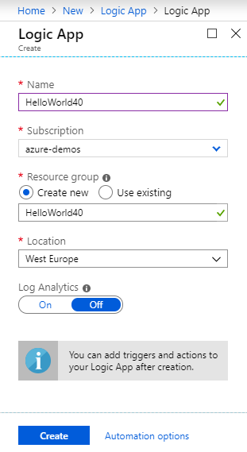
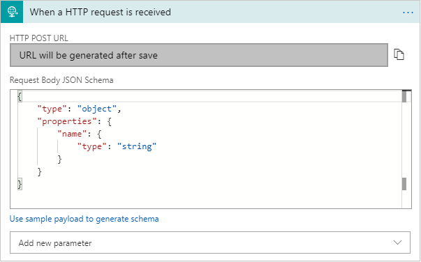

# Hello, World! with Azure Logic App

1. Log in to [Azure Portal](htps://portal.azure.com).
2. Click on the **Create a resource** link at the upper-left corner.
3. Search for "Logic App", and then select **Logic App**.
4. Click on the **Create** button.
5. Enter a *Name*, select (or create) target resource group, and then click on the **Create** button.

6. Once the Logic App is created, go to the deployed resource. You can get the link by clicking on the notification icon (a bell) to the upper-right corner, and click on the  **Go to resource** button.
7. In **Logic App Designer**, click on the **When a HTTP request is received** link.
8. Then, expand the step, and enter a JSON schema for incoming message:
```json
{
    "type": "object",
    "properties": {
        "name": {
            "type": "string"
        }
    }
}
```

 
9. Click on the **+New Step** button.
10. Select **Built-in** > **Actions** > **Response**. 
11. Set the *Response Body* to be "Hello, *\<name filed>*!". Note that you can use the **Dynamic content** to select the *name* field, which is recognized from the JSON schema in step 8.
12. Click on the **Save** button.
13. Expand the first step, and copy the **HTTP POST URL** field.
14. Send a POST request to the URL with a JSON payload:

```JSON
{
    "name": "haishi"
}
```

15.  You should receive a 200 response with a "Hello, haishi!" message.