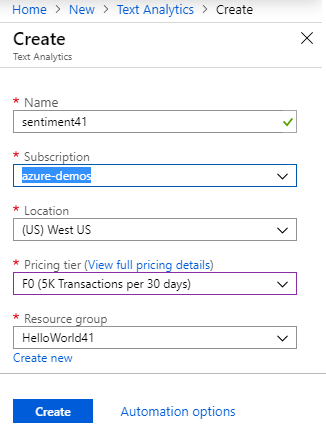
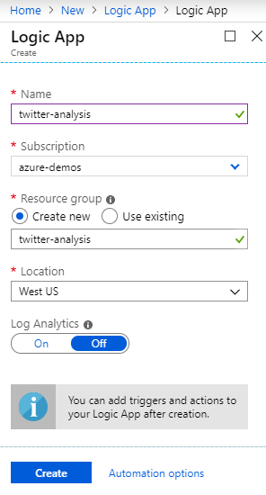
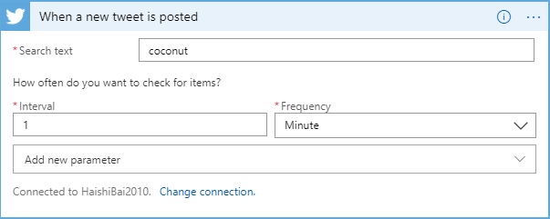
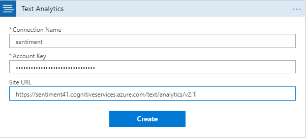
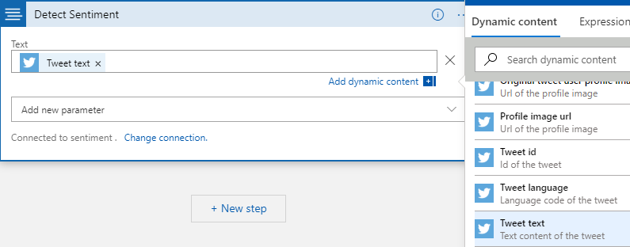
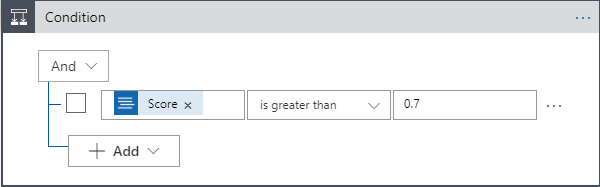
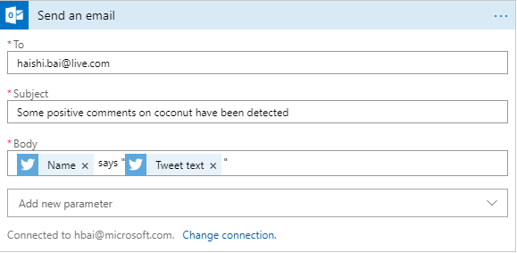

# Twitter Sentiment Analysis with Logic App

1. Log in to [Azure Portal](https://portal.azure.com).
2. Click on the **Create a resource** link at the upper-left corner.
3. Search for "Text Analytics" and select "Text Analytics".
4. Click on the **Create** button.
5. Enter a name for your Cognitive service subscription. Select the subscription, location, and pricing tier, and resource group you want to use. Then, click on the **Create** button.

6. Once the subscription is created, copy its *API Key* and *Endpoint* from its **Quick start** page.
7. Click on the **Create a resource** link at the upper-left corner of the portal.
8. Search for "Logic App" and select "Logic App".
9. Click on the **Create** button.
10. Enter a name for your Logic App. Select the subscription, resource group and location you want to use, and click on the **Create** button.

6. Once the app is created, open the Logic App designer.
7. Click on the **When a new tweet is posted** tile.
8. In the designer view, click on the **Sign in** button to log in to the Twitter account you want to use. 
9. Click on the **Continue** button.
10. Set up target text you want to monitor (such as "coconut") and the interval of checks.

11. Click on the **New Step** button.
12. Search for *sentiment* and click on the **Detect Sentiment** entry.
13. Enter a name for the Cognitive service connection, paste in the *API Key* and the *Endpoint* you've got from step 6. Then, click on the **Create** button.

14. Add a *Text* parameter and set it to **Tweet text** from the previous step.

15. Click on the **New step** button.
16. Search for *condition* and click on the **Condition** entry.
17. Set up the condition to be *Score* (from previous step, through **Dynamic content**) is *greater than* **0.7**.

18. Click on the **Add an action** link under the **If true** branch.
19. Search for *Outlook* and click on the **Send an email** entry.
20. Click on the **Sign in** button to connect to the Office 365 account you want to use.
21. Customize your email as the following example.

22. Click on the **Save** button to save your Logic App.
23. You'll likely to see emails coming in every minute about coconut with somewhat positive comments.
24. To stop the email stream, go back to your Logic App and click the **Disable** button on its **Overview** page.