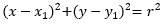
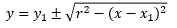
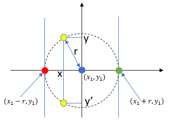
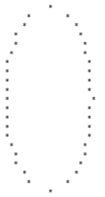
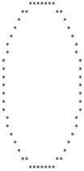
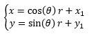
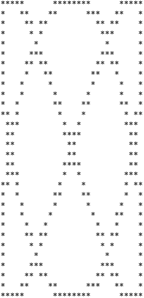

# Print Circles

**Problem:** You want to create a console application that prints out a circle with a user-specified radius.

* **Input:** It shall take an integer input from user between 1 and 50.
* **Output:** It shall print out a circle on the console with the given radius. 

**Required Java constructs:** Loop (_for_), Condition (_if_)

## Analysis
To print out a picture of circle on the console screen, you need to use some characters (such as '*') as pixels and arrange these pixels together into a circle. In order to do this, first you need to understand where to put the pixels. Here's a bit of math:

All points on a circle have a fixed distance to the **center** of the circle. This distance is called **radius**. If we assume the center is at (x1,y1), then any point (x,y) on a circle can be expressed as:

   ...(1)

 where **r** is the radius of the circle. By formula transformation, we can also get that for any give x, we have

   ...(2)

So, we should be able to loop through the x axis, calculate corresponding y's (there are two y's for each x because of the plus-minus sign), place the cursor at the calculated location and print a pixel, as shown in the following diagram:



A few key points in the above diagram:

* The center of the circle is at (x1,y1), as indicated by the blue dot.
* The minimum value of x is x1-r, as indicated by the red dot.
* The maximum value of x is x1+r, as indicated by the green dot.
* As we move x from x1-r to x1+r, for each x we can use formula (2) to calculate two y's and plot two pixels.

This can be implemented by the following pseudo-code:

```java
for (int x = x1 - radius; x <= x1 + radius; x++)
{
    int y_a = y1 - Math.sqrt(radius^2 - (x-x1)^2);
    int y_b = y1 + Math.sqrt(radius^2 - (x-x1)^2);
    <put cursor at (x, y_a)>
    System.out.print('*');
    <put cursor at (x, y_b)>
    System.out.print('*');                
}
```

## Solution 1
The main problem of the initial plan is that it requires us be able to place console cursor at anywhere we want. However, Java doesn't have a built-in function for that. Instead, when we print on console, we always append to an output stream - in other words, we can only print line by line, from top to bottom. 

> Note: In console coordinate, y is positive going down.

How do we solve this? In the original plan, x is going left to right, which isn't a problem for console output. The problem is y is jumpy - it goes up and down all the time. In order to print console, we need to make sure x is going left to right, and y is going top to bottom.

How about we loop through y instead of x? This makes sure y is going top to bottom:

```java
for (int y = y1 - radius; y <= y1 + radius; y++)
{
    int x_a = x1 - Math.sqrt(radius^2 - (y-y1)^2);
    int x_b = x1 + Math.sqrt(radius^2 - (y-y1)^2);
    <put cursor at (x_a, y)>
    System.out.print('*');
    <put cursor at (x_b, y)>
    System.out.print('*');                
}
```
This doesn't change much, does it? As a matter of fact, this change helps a lot. Now, we have lines in order, let's take a closer look at what happens within a line. Which is smaller, x_a or x_b? Obviously, x_a is smaller because it's subtracted from the center location. Now we know for sure x_a is to the left, and x_b to the right - this is exactly what we want: lines go from top to bottom, and within a in, characters go from left to right.

Still, we can't place output cursor at random positions, even within a line. To solve this, we'll do a "line scan" - we'll loop x from left to right, and print out a "*" when x equals to x_a or x_b. Please see the **PrintCircleV1.java** file for completed program.

The following diagram shows the output of **PrintCircleV1** when radius is set to 10:

 

### Future Improvements
* As you can see from the above screenshot, there are some gaps in the circle, especially where is close to the top and the bottom. This is because the code prints out at most two "*" per line. Can you think of ways to improve this?

## Solution 2
Solution 2 uses a more brute-force approach. Instead of doing line scans as in solution 1, it performs pixel-level scan, going from the top-left corner of the screen to the bottom-right corner. As it scans, it checks if a pixel should be lit by checking if the coordinate (x,y) satisfies formula (1):

```java
for (int y = y1-radius; y <= y1+radius; y++)
{
    for (int x = x1-radius; x <= x1+radius; x++)
    {
        if (Math.abs((x-x1)*(x-x1) + (y-y1)*(y-y1) - radius*radius) < radius)
            System.out.print('*');
        else
            System.out.print(' ');
    }
    System.out.println();
}
```
Please note instead of checking if the coordinate has the exact radius to the center, the code checks if the error is in an acceptable range. Please see the **PrintCircleV2.java** file for completed program.
The following diagram shows the output of **PrintCircleV2** when radius is set to 10:



### Future Improvements
* How do you extend the program to print a solid circle? 

## Solution 3
Can we somehow overcome the constraint of linear scanning as we've seen in previous solutions? We can do this by separating concerns - we'll split graph generation and graph output. First, we'll allocate a buffer with a two-dimensional array as a buffer, with the coordinates of the array corresponding to screen coordinates. We'll populate the buffer with pixels, and then push the buffer to output. Because the buffer is not constrained by the streaming nature of the console, we can access buffer positions randomly by using "buffer[x][y]". 

**PrintCircleV3.java** shows the buffer implementation. Please note the code uses a different formula to plot circles - instead of looping through x or y coordinate, it loops through an angle from 0 to 360 degree, and use formula:

   ...(3)

to calculate corresponding (x,y). The calculation is encapsulated in a separate **fillBuffer** method. Solution 3 allows other functions to be plugged into the program. For example, if you replace the **fillBuffer** call with the  **fillBufferwithFunction** call, you'll get a totally different graph:



### Future Improvements
* Try to plug in a different function to the program.
* A "pixel" on console is not a perfect square. Instead, it's a tall rectangle. How can you adapt your program to compensate?