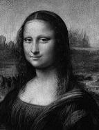
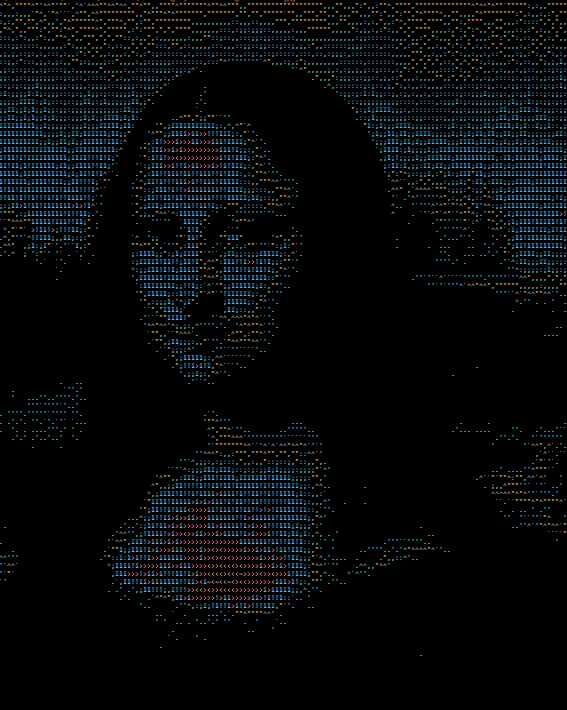

# Print Images

**Problem:** You want to print an image as an ASCII image.

* **Input:** It shall take an image file and desired output size (width X height). 
* **Output:** It shall print out an ASCII image based on the image content. For example, for an input image:



The program should generate:



**Required Java constructs:** Loop (_for_), Condition (_if_), File IO.

## Analysis

When ASCII characters are printed on the console, simpler characters are darker than complex characters because they have fewer lit pixels on screen. For example, a dot (.) has a single pixel, while a dollar sigh ($) has many more pixels. You can use this fact to use different characters to represent different grayscales. For example, the following string can approximate over 70 grayscale levels.

$@B%8&WM#*oahkbdpqwmZO0QLCJUYXzcvunxrjft/\\|()1{}[]?-_+~<>i!lI;:,\"^`\'. 


To convert any image into an ASCII image, you need to first convert the image into a grayscale image. Then, you need to map the grayscale values into the grayscale levels you can support. To map 0-255 grayscale into a N-level grayscale, you can use the formula:

index = N * grayscale / 255

Another problem is scale. The console window has limited rows and columns, so you need to scale down image into a smaller size. For example, to scale a 100 X 100 bitmap image into a 50 X 50 ASCII image, each "ASCII pixel" corresponds to 4 bitmap pixels. To do this, you can calculate the average grayscale value across the 4 pixels and map the resulting grayscale into corresponding grayscale level.

## Solution
There are many different image formats, and parsing image files isn't necessarily easy. You should use an existing graph library when possible. The sample solution uses **javax.imageio** and **java.awt.image.BufferedImage**:

```java
    img = ImageIO.read(new File(fileName));
    byte[] pixels = ((DataBufferByte)img.getRaster().getDataBuffer()).getData();
```

If an image has an alpha channel, each pixel corresponds to 4 bytes in the resulting **pixels** array: [alpha, blue, green, red]. Each value represents "density" of the corresponding value. For example, red=255, blue=0, green=0, alpha=255 represents a solid red dot. If an image doesn't have an alpha channel, each pixel corresponds to 3 bytes in the array.

To convert an RGB pixel to grayscale, you can simply average the R, G, B value: 

grayscale = (R + G + B) / 3;

To consider alpha channel, you can use:

grayscale = (R + G + B) / 3 * Alpha / 255;

Another commonly used formula to convert RGB color to grayscale is:

grayscale = 0.2989 * R + 0.5870 * G + 0.1140 * B 

You can also try the relative luminance forumlar:

l = 0.2126 * R + 0.7152 * G + 0.0722 * B

You may notice that there are several extra spaces in the **grayscale** string:

```java
  final String grayscale = "$@B%8&WM#*oahkbdpqwmZO0QLCJUYXzcvunxrjft/\\|()1{}[]?-_+~<>i!lI;:,\"^`\'.       ";
```

This is to control the exposure level of the final image. Adding more spaces at the end of the string makes the image darker.