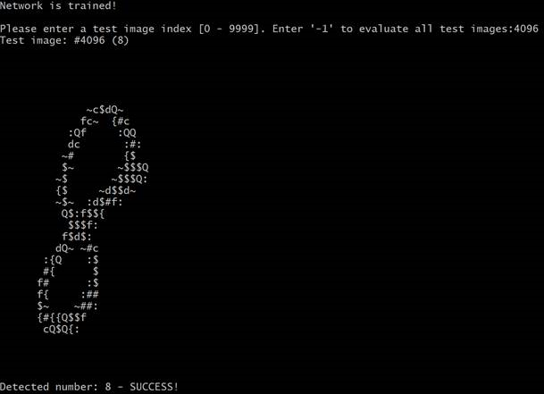

# Digit Classifier

This is a C# implementation of a handwritten digit classifier neuron network in Michael Nielsen's Neural Networks and Deep Learning book.

 

Currently, the trained network has about 95% accuracy, which is to be improved in future iterations.

## Run the code

This project is written with .Net Framework 4.7 using Visual Studio 2017.

1. Download the [MNIST data set](http://yann.lecun.com/exdb/mnist/). Save the 4 archive files (train-images-idx3-ubyte.gz, train-labels-idx1-ubyte.gz, t10k-images-idx3-ubyte.gz, t10k-labels-idx1-ubyte.gz) to a folder of your choice.
2. Modify the first few lines of code in **Program.cs** to point to correct data package files.
3. Compile and run. The code trains on 60,000 images from the training set, and then allows you to classify an individual image from the 10,000-image test set by entering an image id (0-9,999). Or, you can enter '-1' to run against the entire test set. Enter '-2' to exit. Enter '-3' to save the trained model to a text file. Later on, you can launch the program with the file name as a parameter to reload the trained model. 

## Pre-trained models.

There are few trained models under the **trained** folder:

| File | Accuracy | Cost Function | Learning Rate | Regularization | Epoch | Hidden Layer Size |
|------|----------|---------------|---------------|----------------|-------|-------------------|
| quadratic-9640.txt| 96.40% | quadratic | 3.0 | 0.0 | 30 | 30 |
| crossentropy-9800.txt | 98.00% | cross-entropy | 0.5 | 0.0 | 30 | 100 |
| crossentropy-regulated-9780.txt | 97.80% | cross-entropy | 0.1 | 5.0 | 60 | 100 |
| crossentropy-regulated-9820.txt | 98.20% | cross-entropy | 0.1 | 5.0 | 120 | 100 |

To use a pre-trained model, pass the file name to **DigitalClassifier** as a parameter:

**DigitalClassifier.exe** _/path/to/trained/model/file_

